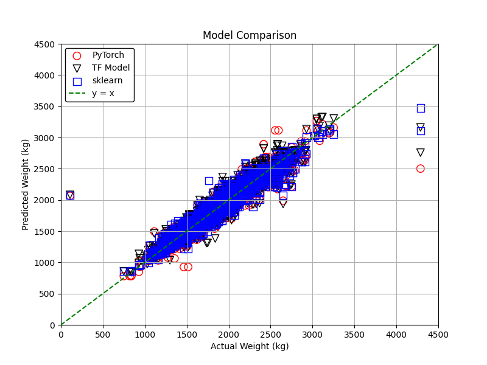
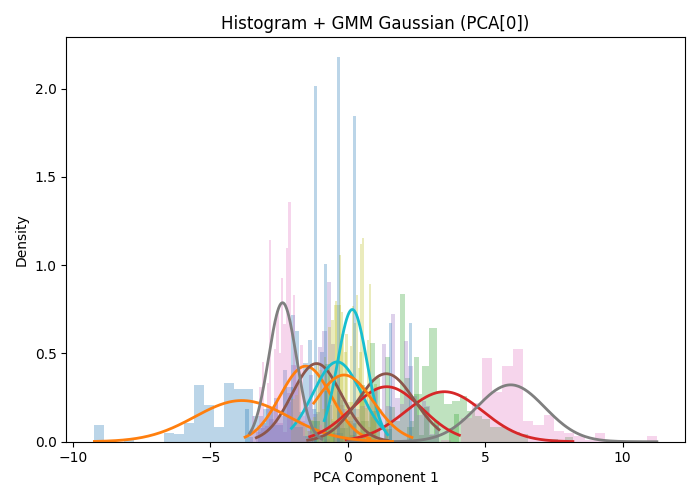
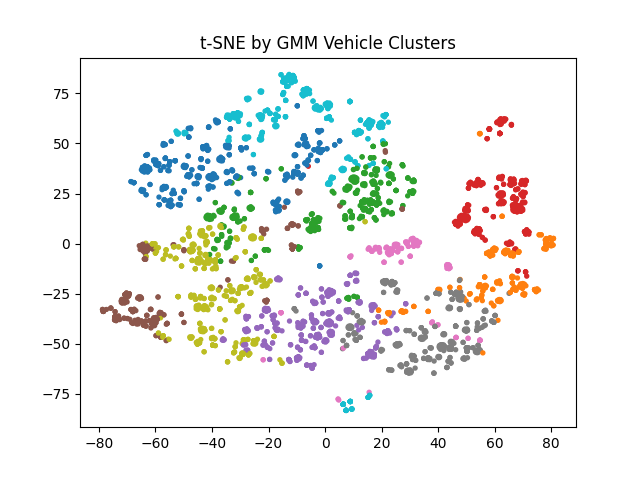

# MLexercise_CarDimensions

In this project, the car weight is predicted from its dimensions using supervised machine learning.

The data was downloaded from:

https://open.canada.ca/data/en/dataset/913f8940-036a-45f2-a5f2-19bde76c1252

A random forest method from scikit learn and neural network models from Tensorflow and PyTorch are compared.
Below is the result without differentiating power train (EV/gasoline)

The data don't contain vehicle types label (SUV, sedan, truck, etc.), so further unsupervised clusterings are done to group them based on their shape and size. 
The plots below are still in notebook.

The vehicle type clustering can be used to classify the power train later on.