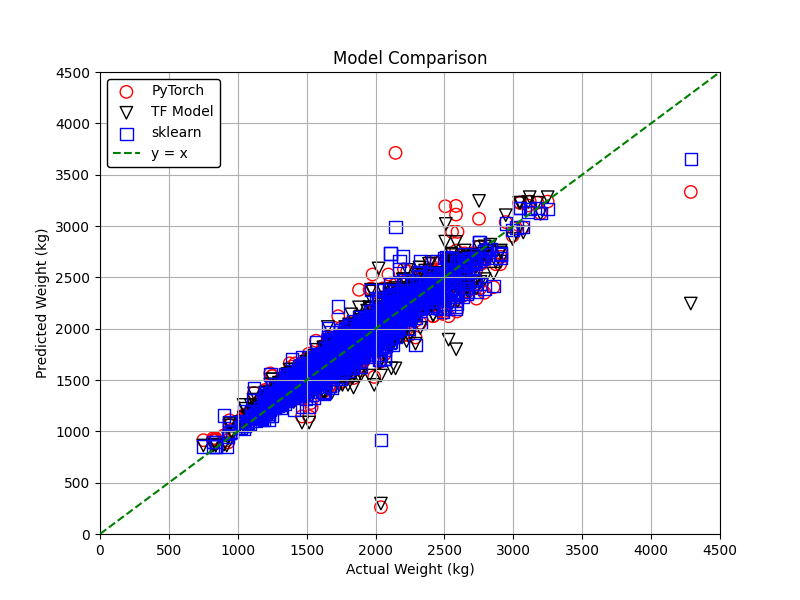

# MLexercise_CarDimensions

In this project, the car weight is predicted from its dimensions using supervised machine learning.

The data was downloaded from:

https://open.canada.ca/data/en/dataset/913f8940-036a-45f2-a5f2-19bde76c1252

A random forest method from scikit learn and neural network models from Tensorflow and PyTorch are compared.

